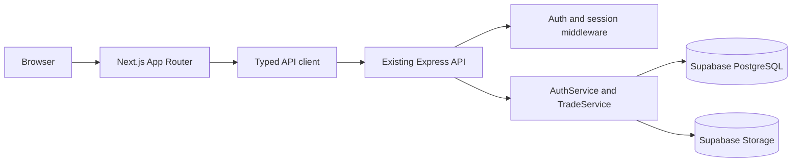

# Next.js Migration System Design

## Status

Proposed for the `backend-implementation` branch.

## Decision Summary

Migrate the Vite frontend to a Next.js App Router application while retaining the existing Express API and Supabase data layer during the first migration. This is an incremental modular-monolith migration, not a database or backend rewrite.

The existing backend is the strongest completed boundary in this repository. It already owns authentication, session revocation, trade CRUD, analytics, screenshot uploads, validation, rate limiting, and security status. The Next.js application should replace the presentation layer first and consume those capabilities through same-origin or explicitly configured HTTP API calls.

## Current Baseline

- Frontend: Vite, React 19, TypeScript, reusable UI components under `src/components`.
- Backend: Express and TypeScript under `backend/src`.
- Persistence: Supabase through `backend/src/database/index.ts`; the older LowDB descriptions in some documentation are stale.
- Existing API roots: `/api/auth`, `/api/trades`, and `/api/security`.
- Migration tooling: `backend/scripts/migrate-lowdb-to-supabase.ts` and `backend/scripts/smoke-supabase-crud.ts`.
- Frontend integration is incomplete: `SecurityMonitor.tsx` calls the backend, while dashboard and trade-entry flows still contain mock or local-only behavior.
- The repository constraint is explicit: the frontend talks to the backend, and only the backend talks to Supabase.

## Options Considered

| Option | Advantages | Costs and risks | Decision |
|---|---|---|---|
| Next.js frontend with Express retained | Smallest change; preserves API, auth, uploads, Supabase access, and rollback to Vite | Two deployables until cutover; requires origin and cookie coordination | **Selected** |
| Move Express routes into Next route handlers immediately | One deployable and simple same-origin routing | High blast radius; duplicates or relocates auth/upload logic; makes WebSocket deployment harder; weakens rollback | Deferred |
| Adopt `r0tk_prisma` as the Next base | Existing Next pages and a connected journal MVP | Different SQLite/Prisma model, unauthenticated API, smaller feature set, and a second domain model to reconcile | Rejected |

## Target Architecture



### Responsibilities

**Next.js presentation layer**

- Own layouts, routing, server/client component composition, loading states, and user-facing error states.
- Use a typed API client for all application data.
- Never import the Supabase service-role client, database adapter, or Prisma client.

**Express application API**

- Remain the source of truth for API behavior during migration.
- Own authentication, authorization, validation, business rules, uploads, and response status codes.
- Keep `/api/*` paths stable while the frontend changes.

**Supabase infrastructure**

- Remain the system of record for users, sessions, trades, screenshots, and analytics cache.
- Continue to be accessed server-side only.
- Treat Storage object paths as canonical for screenshot files; local disk must not be required for a scaled deployment.

## Module and Dependency Boundaries

```text
app/                         Next.js routes and layouts
features/                    Dashboard, trades, analytics, security UI
lib/api/                     Typed HTTP client and DTOs
components/                  Shared presentation components
backend/src/routes/          Express transport adapters
backend/src/services/        Application and domain services
backend/src/database/        Supabase infrastructure adapter
```

Dependency rules:

1. Next components depend on `lib/api`, never on Supabase or database tables.
2. HTTP routes parse requests and delegate; they should not contain database workflows.
3. Services must not depend on React, Next, or Express response objects.
4. Database and Storage details stay behind backend infrastructure adapters.
5. Frontend DTOs are explicit API contracts, not direct Supabase row types.

Do not split analytics, screenshots, dashboard, or journal entries into independent services yet. They are currently capabilities of the trading-journal module, and separate deployment would add operational complexity without an established scaling or ownership need.

## API Compatibility Contract

The initial Next.js frontend must call the existing backend contracts without changing their meaning.

- Preserve `/api/auth/register`, `/login`, `/logout`, `/profile`, `/password`, `/dashboard`, and `/analytics`.
- Preserve `/api/trades` and `/api/trades/:id` methods and status codes, including `201`, `204`, `400`, `401`, `403`, `404`, and `409`.
- Preserve login response fields `{ user, token }` during the compatibility period.
- Preserve validation errors as `{ error: "Validation failed", details: [...] }`.
- Preserve trade filter names: `pair`, `session`, `emotion`, `strategy`, `start_date`, `end_date`, `min_pnl`, `max_pnl`, `limit`, and `offset`.
- Preserve multipart field `screenshots`, the five-file limit, image-only policy, and 10 MB default limit until the Storage migration is complete.
- Add contract tests before changing or removing the Express implementation.

The current implementation uses bearer tokens in the `Authorization` header. Some documentation describes HttpOnly cookies instead. Choose one browser transport before production cutover; the recommended target is an HttpOnly, Secure, SameSite cookie issued by the backend, while accepting bearer tokens during the compatibility window.

## Authentication and Authorization

### Compatibility phase

- Keep `AuthService` as the owner of bcrypt verification, JWT signing, and `auth_sessions` checks.
- Continue validating `userId`, `username`, and `sessionId` claims.
- Continue revoking sessions on logout and password change.
- Make the Next API client send credentials according to the selected transport; do not duplicate token verification in Next.
- Keep `SUPABASE_SERVICE_ROLE_KEY` server-only.

### Later Supabase Auth phase

Supabase Auth is a separate migration and should follow Next.js parity. Map `public.users.auth_id` to `auth.users.id`, define the account migration and recovery path, then retire custom password/session handling only after verification. Do not run two ambiguous sources of identity.

## Data and Screenshot Migration

The Vite-to-Next migration does not require re-migrating existing Supabase rows. Before production cutover, validate the existing LowDB migration independently:

1. Reconcile source and Supabase user, trade, and screenshot metadata counts.
2. Verify every foreign-key relationship and legacy-to-UUID mapping.
3. Resolve historical duplicates against the unique trade constraint explicitly.
4. Copy screenshot binaries into the private Supabase Storage bucket and verify checksums.
5. Rebuild `analytics_cache`; treat it as disposable derived data.
6. Take a backup and assign rollback ownership.

For new uploads, authorize the trade first, generate a user/trade-scoped path, upload through the backend or a short-lived signed upload URL, then persist metadata. Clean up the Storage object if metadata persistence fails, and clean up associated objects when a trade is deleted.

## Migration Plan

### Phase 0: Baseline and contracts

- Add API DTO documentation and contract tests around Express.
- Resolve bearer-token versus cookie behavior, CORS origin, and error conventions.
- Record current frontend mock-data surfaces and define parity cases.

### Phase 1: Next.js shell

- Add Next.js App Router alongside Vite; do not remove Vite.
- Recreate the application shell, navigation, and route-level loading/error states.
- Add a typed backend API client and environment-based API origin configuration.

### Phase 2: Feature parity

- Connect login, logout, and session restoration.
- Replace dashboard mock data with `/api/auth/dashboard`.
- Connect trade creation, listing, filtering, update, and delete operations.
- Connect analytics and security-monitor views.
- Add screenshot upload only after the backend Storage behavior is verified.

### Phase 3: Staged cutover

- Deploy Next and Express side by side.
- Run browser smoke tests and API contract tests against both environments.
- Send staging or a small cohort to Next.
- Compare status codes, response shapes, error rates, latency, and persistence outcomes.
- Switch the primary frontend to Next after the acceptance gates pass.
- Keep Vite and Express available for the agreed stabilization period.

### Phase 4: Consolidation decision

Only after parity is stable, decide whether Express should remain as a separate backend or whether its routes can be moved to Next route handlers. This later decision must preserve service boundaries, tests, auth behavior, and rollback capability.

## Rollback Strategy

- Roll back the frontend by switching traffic from Next to Vite.
- Keep the Express API and Supabase schema forward-compatible during frontend migration.
- Do not roll back database rows for a presentation-layer deployment.
- If a contract must evolve, add a versioned endpoint or compatibility fields rather than silently changing an existing response.
- Retain old frontend assets and deployment configuration until the stabilization window closes.

## Security and Reliability Gates

- Remove the development fallback JWT secret before production and fail closed when `JWT_SECRET` is weak or missing.
- Use strict production CORS or same-origin routing; do not allow a wildcard with credentials.
- Add CSRF protection for cookie-authenticated mutations.
- Keep route-specific limits for login, registration, password changes, trade writes, and uploads.
- Bound `limit` and `offset` values and validate UUIDs before database access.
- Validate upload MIME type and file signature, not only filename extension.
- Never return `password_hash` or raw backend errors.
- Enforce ownership in the service layer even when using Supabase service-role access, because service-role queries bypass RLS.
- Add request IDs, authenticated user context, route, status, duration, and stable error codes to structured logs.
- Track API availability, p95 latency, auth failures, Supabase failures, upload failures, orphaned objects, rate limits, and analytics duration.
- Use timeouts and bounded retries only for safe reads or idempotent writes; add idempotency keys before automatically retrying trade creation or uploads.

## Test Strategy and Acceptance Criteria

Required test layers:

- Backend unit tests for `AuthService`, `TradeService`, validation, ownership, P&L calculations, and session revocation.
- API contract tests for every preserved route, status code, DTO, filter, and error shape.
- Integration tests for register, login, logout, password change, trade CRUD, dashboard, analytics, and screenshot upload.
- Security tests for unauthenticated access, cross-user IDs, expired/revoked sessions, invalid UUIDs, CORS, and upload limits.
- Browser smoke tests for login, dashboard load, trade submission, journal refresh, security status, and logout.
- Repeat-run migration tests for ID mapping, foreign keys, duplicates, metadata, and file checksums.

The migration is accepted only when:

1. Next renders all committed user workflows without mock production data.
2. Express and the Next frontend pass equivalent representative read/write tests.
3. Existing sessions remain valid through the compatibility window.
4. User ownership is enforced for profiles, trades, analytics, and screenshots.
5. Service-role credentials are absent from client bundles.
6. Screenshot operations work without local-disk dependence.
7. Supabase reconciliation and backup checks pass.
8. Rollback to Vite is tested and documented.
9. Agreed availability, latency, and error-rate SLOs are met.

## Immediate Work Queue

1. Add the Next.js app shell without deleting the Vite app.
2. Extract and type the backend API client contracts.
3. Add backend contract tests before frontend rewiring.
4. Connect authentication and dashboard data first.
5. Replace mock trade and analytics data with backend responses.
6. Resolve cookie/bearer behavior and stale architecture documentation.
7. Move screenshot persistence from local disk to Supabase Storage.
8. Run the staged parity and rollback checks before any production cutover.
